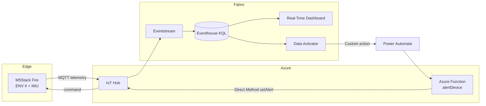

# Demo Real-Time Intelligence & Two-Way Control (IoT ↔ Azure ↔ Microsoft Fabric)

Demo end-to-end **komunikasi dua arah** antara edge device dan cloud:
telemetry mengalir dari **M5Stack Fire** → **Azure IoT Hub** → **Microsoft Fabric**
(Real-Time Dashboard), dan perintah kontrol mengalir balik dari **Fabric Activator**
→ **Azure Function** → **Direct Method** → device (LED + buzzer + LCD).

## Struktur repo

| Folder | Isi |
|--------|-----|
| [firmware/m5stack-fire](firmware/m5stack-fire) | Firmware Arduino: sensor, MQTT/TLS, Direct Method |
| [infra/azure](infra/azure) | Provisioning IoT Hub + routing ke Fabric Eventstream |
| [fabric](fabric) | Skrip KQL + panduan Eventstream → Eventhouse → Dashboard → Activator |
| [functions/iot-alert](functions/iot-alert) | Azure Function jembatan Activator → Direct Method |

## Komponen

| Lapisan | Teknologi |
|---------|-----------|
| Edge | M5Stack Fire (ESP32), unit ENV II (SHT30 + BMP280), IMU |
| Konektivitas | Azure IoT Hub (MQTT/TLS, SAS token, Direct Method) |
| Streaming & analitik | Fabric Eventstream, Eventhouse (KQL), Real-Time Dashboard |
| Otomasi | Fabric Data Activator → Power Automate → Azure Function (Node.js) |

## Urutan setup

1. **Firmware** — flash M5Stack Fire → [firmware/m5stack-fire/README.md](firmware/m5stack-fire/README.md)
2. **Azure IoT Hub** — provisioning + Eventstream → [infra/azure/README.md](infra/azure/README.md)
3. **Fabric** — Eventhouse, Dashboard, Activator → [fabric/README.md](fabric/README.md)
4. **Azure Function** — closed-loop cloud→edge → [functions/iot-alert/README.md](functions/iot-alert/README.md)

## Prasyarat

- M5Stack Fire + unit ENV II/III/IV, kabel USB-C
- Arduino IDE + library `M5Unified`, `M5UnitENV`, `PubSubClient`, `ArduinoJson`
- Azure subscription (IoT Hub, Functions) + Azure CLI
- Microsoft Fabric workspace (kapasitas F2+ atau trial)
- Node.js 18+ dan Azure Functions Core Tools v4

## Lisensi

Demo/edukasi. Sesuaikan sebelum penggunaan produksi.
