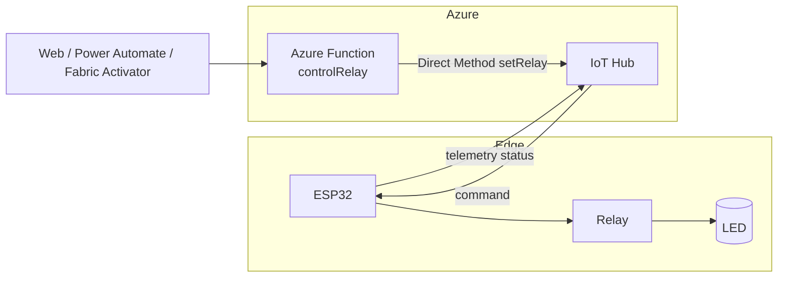

# ESP32 Relay → LED — Kontrol dari Azure

Penambahan requirement untuk demo IoT: perangkat **ESP32** yang menyalakan/mematikan
**LED** melalui **modul relay**, dikontrol dari **Azure** (IoT Hub Direct Method).

Folder ini **berdiri sendiri** dan tidak mengubah komponen M5Stack Fire yang sudah ada.
Ia memakai **IoT Hub yang sama**; cukup daftarkan satu device baru untuk ESP32 relay.



## Isi folder

| Path | Isi |
|------|-----|
| [firmware/esp32-relay](firmware/esp32-relay) | Firmware Arduino ESP32: WiFi, MQTT/TLS, Direct Method `setRelay`/`toggleRelay`, kontrol relay |
| [functions/relay-control](functions/relay-control) | Azure Function HTTP `POST /api/relay` → Direct Method ke device |

## Perubahan yang dilakukan (ringkas)

Requirement ini **tidak mengubah** kode M5Stack Fire, Function `iot-alert`, maupun
skrip Fabric yang sudah ada. Semua tambahan berada di folder ini:

1. **Firmware baru** untuk ESP32 generic (bukan M5Stack): menerima Direct Method
   `setRelay {state:"on|off"}`, `toggleRelay`, `getState`, `reboot`, dan menggerakkan
   relay pada `GPIO26` untuk menyalakan/mematikan LED.
2. **Azure Function baru** `controlRelay` yang memanggil Direct Method tersebut,
   dengan pola yang sama seperti `iot-alert/alertDevice`.
3. Firmware juga mengirim **telemetry status LED** sehingga bisa dipantau di Fabric.

## Langkah setup

1. **Daftarkan device di IoT Hub** (memakai IoT Hub demo yang sudah ada):

   ```powershell
   az iot hub device-identity create --hub-name <NAMA_IOT_HUB> --device-id esp32-relay-01
   az iot hub device-identity connection-string show --hub-name <NAMA_IOT_HUB> --device-id esp32-relay-01
   ```

   Catat **primary key**-nya.

2. **Flash firmware** — lihat [firmware/esp32-relay/README.md](firmware/esp32-relay/README.md):
   - `Copy-Item firmware/esp32-relay/config.example.h firmware/esp32-relay/config.h`
   - isi WiFi, host IoT Hub, `IOT_DEVICE_ID = esp32-relay-01`, primary key
   - sesuaikan `RELAY_PIN` / `RELAY_ACTIVE_HIGH` dengan modul relay Anda
   - upload ke ESP32 (board: *ESP32 Dev Module*)

3. **Jalankan Azure Function** — lihat [functions/relay-control/README.md](functions/relay-control/README.md):
   - `Copy-Item functions/relay-control/local.settings.json.example functions/relay-control/local.settings.json`
   - isi `IOTHUB_CONNECTION_STRING` (policy `service`) dan `DEFAULT_DEVICE_ID`
   - `npm install ; npm start`

4. **Uji nyala/mati LED**:

   ```powershell
   $u = "http://localhost:7071/api/relay"
   Invoke-RestMethod -Method Post -Uri $u -ContentType "application/json" -Body (@{ state="on"  } | ConvertTo-Json)
   Invoke-RestMethod -Method Post -Uri $u -ContentType "application/json" -Body (@{ state="off" } | ConvertTo-Json)
   ```

## Integrasi opsional dengan Fabric

Karena device memakai IoT Hub yang sama, telemetry `relay`/`ledOn` otomatis masuk
ke Eventstream/Eventhouse yang sudah ada. Anda bisa memicu on/off dari **Data
Activator → Power Automate → Function `controlRelay`**, persis pola closed-loop
pada demo M5Stack Fire.

## Keamanan

- Jangan commit `config.h` maupun `local.settings.json` (sudah di-`.gitignore` per folder).
- Untuk produksi: DPS + X.509 untuk device, Managed Identity + Key Vault untuk Function.
