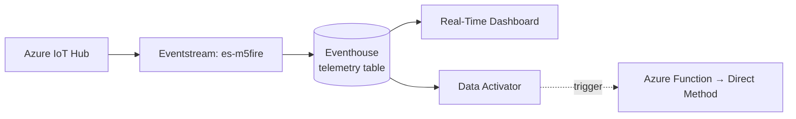

# Setup Microsoft Fabric — Eventstream → Eventhouse → Real-Time Dashboard

Bagian ini membuat **Eventstream** untuk menarik telemetry dari Azure IoT Hub,
menyimpannya ke **Eventhouse (KQL)**, memvisualisasikannya di **Real-Time
Dashboard**, lalu menyiapkan **Data Activator** untuk trigger.



## Prasyarat

- Workspace Fabric dengan kapasitas **F2+** atau **trial** aktif.
- Azure IoT Hub sudah menerima telemetry dari device (terverifikasi via `az iot hub monitor-events`).
- Consumer group `fabric` sudah dibuat di IoT Hub (lihat provisioning).

## Bagian A — Buat Eventstream & sambungkan ke IoT Hub

Eventstream adalah pipa yang menarik telemetry dari IoT Hub masuk ke Fabric.

1. Di workspace: **+ New item** → **Eventstream** → nama `es-m5fire`.
2. Pada kanvas: **Add source** → **Azure IoT Hub**.
3. **New connection**, lalu isi:
   - **IoT Hub**: `iothub-demo-v640s`
   - **Shared access policy name**: `service` (atau `iothubowner`)
   - **Shared access key**: ambil dengan perintah di bawah
   - **Consumer group**: `fabric`
   - **Data format**: `Json`
4. **Add** → **Publish**.

Ambil shared access key untuk policy `service`:

```powershell
az iot hub policy show --hub-name iothub-demo-v640s --name service --query primaryKey -o tsv
```

**Verifikasi:** klik node source di kanvas → tab **Data preview** harus
menampilkan telemetry M5Stack yang mengalir real-time. Jika kosong, cek device
mengirim, consumer group `fabric`, dan format `Json`.

## Bagian B — Buat Eventhouse & KQL Database

1. Di workspace: **+ New item** → **Eventhouse** → nama `eh-iot-demo`.
2. Eventhouse otomatis membuat satu **KQL Database** (mis. `eh-iot-demo`).
3. Buka database → **New** → **KQL Queryset** untuk menjalankan skrip.

## Bagian C — Buat tabel telemetry

Dua opsi:

**Opsi 1 — Otomatis via Eventstream (paling mudah):**
lewati skrip; tabel dibuat saat menambah destination di Bagian D. Fabric
mendeteksi skema dari JSON.

**Opsi 2 — Manual (kontrol penuh skema):**
jalankan [kql/01-create-table.kql](kql/01-create-table.kql) di KQL Queryset.
Ini membuat tabel `telemetry` + JSON mapping + retensi 7 hari.

| Kolom | Tipe | Sumber JSON |
|-------|------|-------------|
| `deviceId` | string | `deviceId` |
| `temperature` | real | `temperature` |
| `humidity` | real | `humidity` |
| `pressure` | real | `pressure` |
| `vibration` | real | `vibration` |
| `noiseLevel` | int | `noiseLevel` |
| `status` | string | `status` |

> **Waktu (timestamp)**: tabel tidak punya kolom waktu. Payload device tidak
> mengirim timestamp, dan *enqueued time* IoT Hub adalah properti sistem (bukan
> body JSON) sehingga tidak muncul di dialog **Map schema**. Query dashboard
> mengambil waktu dari fungsi bawaan Kusto `ingestion_time()` — tidak perlu
> mapping waktu apa pun.

## Bagian D — Hubungkan Eventstream ke Eventhouse

1. Buka Eventstream `es-m5fire` → **Edit**.
2. Pada kanvas: **Add destination** → **Eventhouse**.
3. Konfigurasi:
   - **Data ingestion mode**: *Event processing before ingestion*
   - **Workspace / Eventhouse / KQL Database**: pilih `eh-iot-demo`
   - **Destination table**: `telemetry` (pilih existing bila memakai Opsi 2,
     atau ketik nama baru untuk auto-create)
   - **Input data format**: `Json`
   - **Mapping**: pakai `telemetry_mapping` (Opsi 2) atau biarkan auto-map.
     Di dialog **Map schema**, ke-7 field body (deviceId…status) terpetakan
     otomatis. **Tidak ada** field waktu untuk dipetakan — itu normal, waktu
     diambil dari `ingestion_time()` di query.
4. **Add** → **Publish**.

Setelah beberapa detik, verifikasi ingesti di KQL Queryset:

```kusto
telemetry | take 20
telemetry | count
```

## Bagian E — Real-Time Dashboard

1. Di workspace: **+ New item** → **Real-Time Dashboard** → nama `rtd-iot-demo`.
2. **+ Add tile** → pilih **Data source** = KQL Database `eh-iot-demo`.
3. Tempel query dari [kql/02-dashboard-queries.kql](kql/02-dashboard-queries.kql).
   Tiap blok komentar adalah satu tile:

| Tile | Isi | Visual |
|------|-----|--------|
| 1 | KPI pembacaan terakhir per device | Stat / Multi stat |
| 2 | Tren suhu real-time | Time chart |
| 3 | Kelembapan & tekanan | Time chart |
| 4 | Getaran (lonjakan) | Time chart |
| 5 | Distribusi status | Pie |
| 6 | Gauge suhu terkini | Stat + conditional format |
| 7 | Log alert suhu kritis | Table |
| 8 | Deteksi anomali (ML) | Anomaly chart |

4. **Auto refresh**: aktifkan di toolbar dashboard, set interval mis. **5 detik**.
5. Untuk Tile 6, atur *conditional formatting*: hijau `<35`, kuning `35–40`, merah `>40`.
6. **Save** dashboard.

> Demo: panaskan sensor ENV (tiup napas hangat) → Tile 2 & 6 naik real-time,
> Tile 7 memunculkan baris alert saat suhu ≥ 40 °C.

## Bagian F — Data Activator (trigger otomatis)

Menyiapkan closed-loop: deteksi kondisi → picu aksi ke device.

**Jalur A — dari tile dashboard (paling mudah):**
Activator memakai **query tile** sebagai sumber; Anda tidak menempel KQL, cukup
pilih kolom dan kondisi lewat dropdown.

1. Pada tile suhu (Tile 6), klik **... → Add alert**.
2. Isi form **Add rule**:
   - **Run query every**: `1 minute`
   - **Check**: `On each event when`
   - **Grouping field**: `deviceId` (opsional)
   - **When**: kolom `temperature`
   - **Condition**: `Is greater than or equal to`
   - **Value**: `40` (turunkan ke `35` bila susah memanaskan sensor)
3. **Action**: `Message to individuals` (email/Teams) untuk demo cepat, atau
   panggil **Azure Function** (langkah berikutnya) untuk closed-loop ke device.
4. **Create**.

**Jalur B — dari Eventstream (lebih fleksibel, bisa pakai KQL):**
**+ New item → Activator → Get data → Eventstream `es-m5fire`**, lalu terapkan
logika seperti [kql/03-activator-detection.kql](kql/03-activator-detection.kql)
(mis. rata-rata 30 detik ≥ 40 °C).

## Troubleshooting

| Gejala | Penyebab | Solusi |
|--------|----------|--------|
| `telemetry` kosong | Destination belum publish / mapping salah | Publish Eventstream; cek format `Json` |
| `enqueuedTime` tak bisa dipetakan di Map schema | Itu properti sistem, bukan body JSON | Abaikan; query pakai `ingestion_time()` |
| Dashboard tidak update | Auto refresh mati | Aktifkan auto refresh 5s |
| Angka desimal jadi string | Tipe kolom salah | Buat tabel via Opsi 2 dengan tipe `real`/`int` |

## Berikutnya

Langkah terakhir demo: **Azure Function** sebagai jembatan dari Activator ke
**Direct Method** IoT Hub, sehingga cloud dapat mengontrol balik M5Stack Fire
(closed-loop cloud-to-edge).
