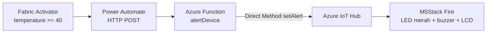

# Azure Function — Jembatan Activator → Direct Method (closed-loop)

HTTP-triggered Azure Function (Node.js) yang menerima trigger dari **Fabric Data
Activator** (via Power Automate) lalu memanggil **Direct Method `setAlert`** ke
M5Stack Fire melalui Azure IoT Hub. Inilah penutup loop **cloud → edge**.



## Struktur

| File | Fungsi |
|------|--------|
| [src/functions/alertDevice.js](src/functions/alertDevice.js) | HTTP trigger → IoT Hub Direct Method |
| [host.json](host.json) | Konfigurasi host Functions |
| [package.json](package.json) | Dependency (`@azure/functions`, `azure-iothub`) |
| [local.settings.json](local.settings.json) | Setting lokal (JANGAN commit; ada key) |

## Prasyarat

- **Node.js 18+**
- **Azure Functions Core Tools v4**: 
`Set-ExecutionPolicy -Scope CurrentUser -ExecutionPolicy RemoteSigned`
`npm i -g azure-functions-core-tools@4 --unsafe-perm true`
- **Azure CLI** sudah login

## 1. Ambil IoT Hub connection string (policy `service`)

```powershell
az iot hub connection-string show --hub-name iothub-demo-v640s --policy-name service --query connectionString -o tsv
```

Tempel hasilnya ke `IOTHUB_CONNECTION_STRING` di [local.settings.json](local.settings.json).

## 2. Jalankan & uji lokal

```powershell
cd functions/iot-alert
npm install
func start
```

Uji dengan device **online** (M5Stack menyala):

```powershell
$body = @{ deviceId = "m5fire-01"; ledColor = "red"; buzzer = $true; message = "TEST cloud" } | ConvertTo-Json
Invoke-RestMethod -Method Post -Uri "http://localhost:7071/api/alertDevice" -Body $body -ContentType "application/json"
```

M5Stack akan menampilkan alert merah + buzzer, dan response berisi
`deviceStatus: 200` dari device.

## 3. Deploy ke Azure

```powershell
# Buat Function App (sekali). Storage & plan consumption.
az storage account create -n stiotfuncv640s -g rg-demo-iot-fabric -l southeastasia --sku Standard_LRS
az functionapp create -n func-iot-alert-v640s -g rg-demo-iot-fabric `
  --consumption-plan-location southeastasia `
  --runtime node --runtime-version 24 --functions-version 4 `
  --storage-account stiotfuncv640s

# Set connection string sebagai app setting
$cs = az iot hub connection-string show --hub-name iothub-demo-v640s --policy-name service --query connectionString -o tsv
az functionapp config appsettings set -n func-iot-alert-v640s -g rg-demo-iot-fabric `
  --settings IOTHUB_CONNECTION_STRING="$cs" DEFAULT_DEVICE_ID="m5fire-01"

# Publish kode
func azure functionapp publish func-iot-alert-v640s
```

Ambil URL + function key:

```powershell
az functionapp function keys list -n func-iot-alert-v640s -g rg-demo-iot-fabric --function-name alertDevice
```

URL endpoint: `https://func-iot-alert-v640s.azurewebsites.net/api/alertDevice?code=<FUNCTION_KEY>`

Uji versi cloud:
```powershell
$uri = "https://func-iot-alert-v640s.azurewebsites.net/api/alertDevice?code=<FUNCTION_KEY>"
Invoke-RestMethod -Method Post -Uri $uri -Body $body -ContentType "application/json"
```

## 4. Hubungkan Fabric Activator → Function (via Custom action / Power Automate)

Activator tidak punya aksi HTTP native; jembatannya adalah **Custom action** yang
memicu **Power Automate**. Di rule Activator, pilih **Action → Custom action**,
lalu ikuti dialog *New custom action*:

**Step 1 — Define custom action**
- **Action name**: mis. `Temperature Device Alert`.
- **Input fields**: tambahkan (ketik + **Add**) field yang mau dikirim ke flow:
  - `deviceId`
  - `temperature`

**Step 2 — Copy connection string**
- Klik **Copy** (dipakai menyambungkan trigger flow ke Activator ini).

**Step 3 — Open flow builder** → Power Automate terbuka dengan trigger Activator:
1. Trigger otomatis: **"When a Fabric Activator alert is triggered"**.
2. **+ New step** → **HTTP** (POST):
   - **URI**: `https://func-iot-alert-v640s.azurewebsites.net/api/alertDevice?code=<FUNCTION_KEY>`
   - **Headers**: `Content-Type: application/json`
   - **Body**:
     ```json
     { "deviceId": "m5fire-01", "ledColor": "red", "buzzer": true, "message": "OVERHEAT dari Fabric" }
     ```
3. **Save** flow → kembali ke Activator → **Done** → **Start** rule.

> **Tanpa HTTP premium?** Ganti langkah 2 dengan aksi **Azure Functions → Call an
> Azure function**, pilih Function App `func-iot-alert-v640s` dan function
> `alertDevice`, lalu isi Request Body JSON yang sama. Konektor ini non-premium
> dan tidak perlu URL+key manual.

Ambil URL + function key (untuk jalur HTTP):
```powershell
az functionapp function keys list -n func-iot-alert-v640s -g rg-demo-iot-fabric --function-name alertDevice
```

Alur akhir: suhu ≥ 35 °C → Activator → Custom action → Power Automate → Function →
Direct Method → M5Stack menyala merah + buzzer. **Closed-loop selesai.**

## Keamanan

- `local.settings.json` dan connection string tidak boleh di-commit (sudah di `.gitignore`).
- Function memakai `authLevel: 'function'` sehingga butuh function key di URL.
- Untuk produksi, pakai **Managed Identity** ke IoT Hub alih-alih connection string,
  dan simpan rahasia di **Key Vault**.

## Troubleshooting

| Gejala | Penyebab | Solusi |
|--------|----------|--------|
| `DeviceNotOnline` / 404 | M5Stack offline | Pastikan device menyala & MQTT connected |
| 500 `IOTHUB_CONNECTION_STRING belum di-set` | App setting kosong | Set app setting / local.settings.json |
| 401 saat panggil Function | Function key salah | Ambil ulang key via `function keys list` |
| Timeout | Device lambat / jaringan | Naikkan `responseTimeoutInSeconds` |
