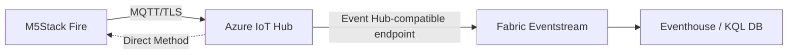

# Setup Azure IoT Hub + Routing ke Fabric Eventstream

Panduan menyiapkan **Azure IoT Hub** sebagai gateway device, lalu mengalirkan
telemetry dari M5Stack Fire ke **Microsoft Fabric Eventstream**.



## Bagian A — Provisioning Azure IoT Hub

### Opsi 1: Script otomatis (disarankan)

```powershell
cd infra/azure
Set-ExecutionPolicy -Scope Process -ExecutionPolicy Bypass -Force   # izinkan script di sesi ini
az login
az extension add --name azure-iot   # sekali saja
./provision-iot-hub.ps1
```

Script [provision-iot-hub.ps1](provision-iot-hub.ps1) membuat resource group,
IoT Hub, consumer group `fabric`, dan device `m5fire-01`, lalu menampilkan
kredensial untuk diisi ke [../../firmware/m5stack-fire/config.h](../../firmware/m5stack-fire/config.h).

> **Error "running scripts is disabled on this system"?**
> Kebijakan default Windows memblokir file `.ps1`. Pilih salah satu:
> - **Sesi ini saja (disarankan):** `Set-ExecutionPolicy -Scope Process -ExecutionPolicy Bypass -Force`
>   lalu jalankan script. Kembali normal saat window PowerShell ditutup.
> - **Permanen untuk akun Anda:** `Set-ExecutionPolicy -Scope CurrentUser -ExecutionPolicy RemoteSigned`
>   (tidak butuh admin; script internet tak bertanda tangan tetap diblokir).
> - **Tanpa ubah policy:** `powershell -ExecutionPolicy Bypass -File ./provision-iot-hub.ps1`

### Opsi 2: Manual via Azure CLI

```bash
# 1. Resource group
az group create -n rg-demo-iot-fabric -l southeastasia

# 2. IoT Hub (S1; pakai F1 untuk free tier)
az iot hub create -n iothub-demo-xxxxx -g rg-demo-iot-fabric --sku S1

# 3. Consumer group khusus Fabric (WAJIB — jangan pakai $Default)
az iot hub consumer-group create --hub-name iothub-demo-xxxxx \
  -g rg-demo-iot-fabric --name fabric

# 4. Daftarkan device
az iot hub device-identity create --hub-name iothub-demo-xxxxx --device-id m5fire-01

# 5. Ambil primary key untuk config.h
az iot hub device-identity connection-string show \
  --hub-name iothub-demo-xxxxx --device-id m5fire-01
```

### Isi `config.h`

Dari connection string `HostName=...;DeviceId=...;SharedAccessKey=...`, ambil:

| Bagian connection string | Isi ke config.h |
|--------------------------|-----------------|
| `HostName` | `IOT_HUB_HOST` |
| `DeviceId` | `IOT_DEVICE_ID` |
| `SharedAccessKey` | `IOT_DEVICE_KEY` |

### Verifikasi telemetry masuk

Setelah firmware di-flash, pantau pesan yang masuk ke Hub:

```bash
az iot hub monitor-events --hub-name iothub-demo-xxxxx --device-id m5fire-01
```

Jika muncul JSON telemetry, koneksi device→cloud berhasil.

## Bagian B — Routing ke Fabric Eventstream

Fabric Eventstream punya **source connector bawaan untuk Azure IoT Hub** yang
membaca dari *Event Hub-compatible endpoint* menggunakan consumer group.

### Langkah di Fabric Portal

1. Buka **Fabric** → pilih/buat **Workspace** (butuh kapasitas F2+ atau trial).
2. **+ New item** → **Eventstream** → beri nama, mis. `es-m5fire`.
3. Di kanvas Eventstream: **Add source** → **Azure IoT Hub**.
4. **New connection** dan isi:
   - **IoT Hub namespace / name**: `iothub-demo-xxxxx`
   - **Shared access policy name**: `service` (atau `iothubowner`)
   - **Shared access key**: ambil dengan perintah di bawah
   - **Consumer group**: `fabric` (yang dibuat di Bagian A)
   - **Data format**: `Json`
5. **Add** lalu **Publish** eventstream.

Ambil shared access key untuk policy `service`:

```bash
az iot hub policy show --hub-name iothub-demo-xxxxx --name service \
  --query primaryKey -o tsv
```

### Verifikasi di Fabric

- Di kanvas Eventstream, klik node source → tab **Data preview** akan
  menampilkan pesan telemetry yang mengalir dari M5Stack secara real-time.
- Jika kosong: pastikan device mengirim, consumer group `fabric` dipakai, dan
  data format `Json` benar.

## Bagian C — Destination (persiapan langkah berikutnya)

Eventstream perlu tujuan agar data tersimpan & bisa divisualisasikan:

- **Add destination** → **Eventhouse (KQL Database)** → buat/ pilih KQL DB dan
  tabel tujuan (mis. `telemetry`).
- Detail Eventhouse, tabel KQL, dan Real-Time Dashboard dibahas di langkah
  berikutnya (setup Fabric).

## Troubleshooting

| Gejala | Penyebab umum | Solusi |
|--------|---------------|--------|
| Device gagal konek MQTT (rc=-2) | Waktu belum sinkron / SAS salah | Cek NTP & primary key di config.h |
| `monitor-events` kosong | Device belum kirim / salah Hub | Cek Serial Monitor, host di config.h |
| Eventstream preview kosong | Consumer group salah / format bukan Json | Pakai consumer group `fabric`, format `Json` |
| Error auth di Eventstream | Policy/key salah | Gunakan policy `service` + primaryKey-nya |

## Keamanan

- Kredensial device kini ada di `config.h`. File tersebut sudah diabaikan lewat
  [.gitignore](../../.gitignore) — jangan commit key asli.
- Untuk produksi, gunakan **DPS + X.509** ketimbang SAS key statis.
