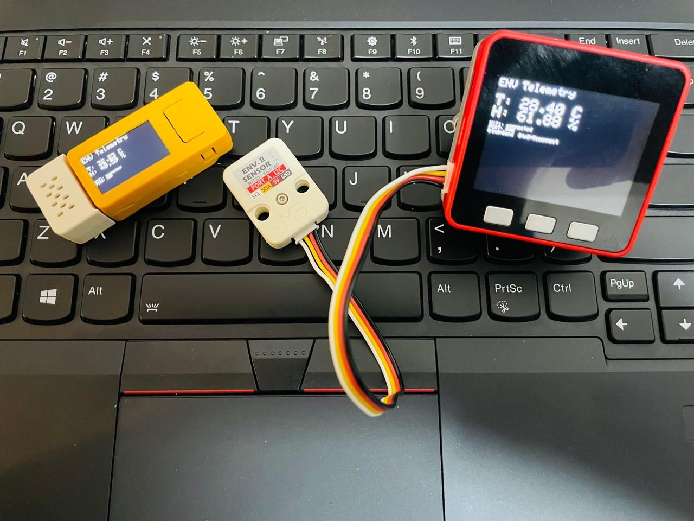
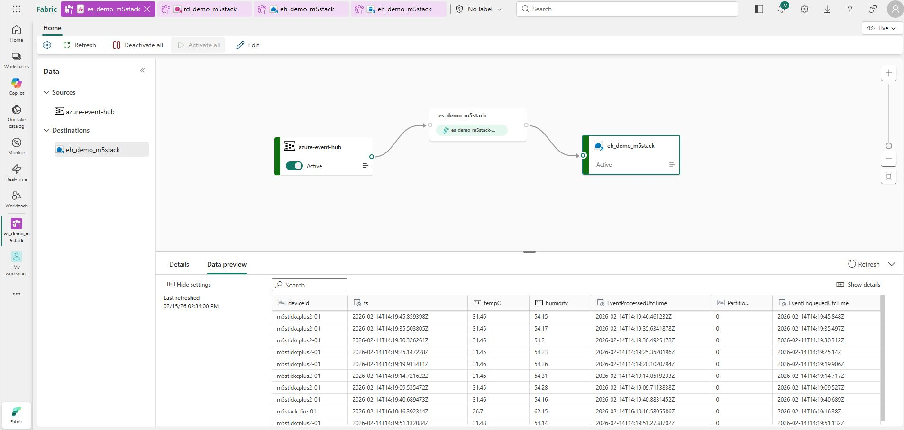
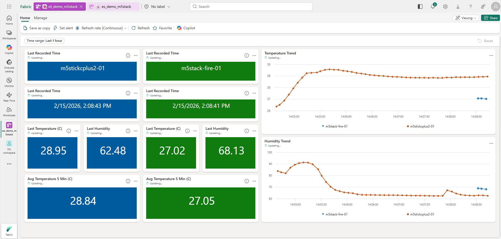
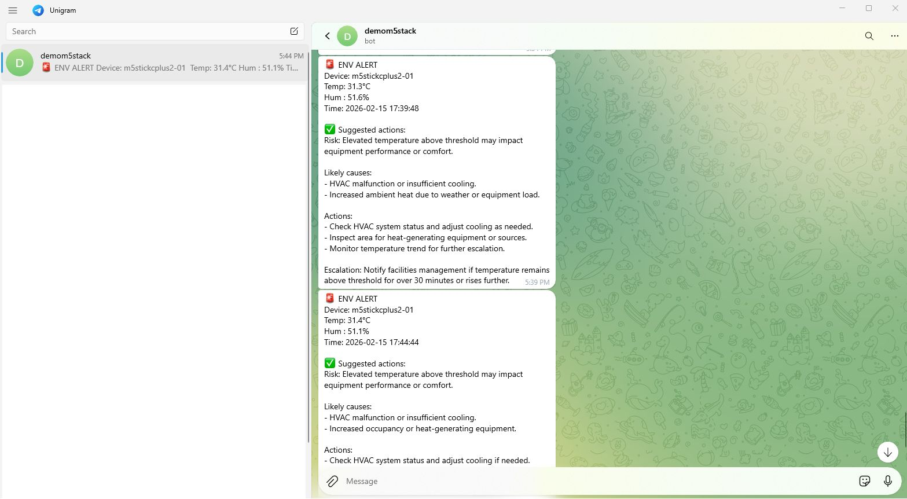

# IoT + Microsoft Fabric + Azure AI Foundry Smart Environment Alerting System

This project demonstrates an end-to-end **real-time IoT monitoring and intelligent alerting system** using:

- M5Stack Fire & M5StickC Plus2 + ENV sensor  
- Azure Functions  
- Azure Event Hub  
- Microsoft Fabric (Eventstream, Eventhouse, Real-Time Dashboard, Activator, Notebook)  
- Azure AI Foundry (LLM)  
- Telegram Bot  

The solution detects abnormal temperature/humidity conditions and automatically sends a **Telegram alert enriched with LLM-generated recommended actions**.


*M5StickC Plus2 and M5Stack Fire reading temperature & humidity from the ENV Unit sensor.*

## Features

- Real-time telemetry ingestion
- Native Fabric streaming storage
- Real-time dashboard visualization
- Threshold-based alerting with Fabric Activator
- Notebook-triggered workflow
- LLM-generated operational guidance:
  - Risk
  - Likely causes
  - Immediate actions
  - Escalation criteria
- Telegram alert delivery

---

## Telemetry Schema

Each device sends JSON:

```json
{
  "deviceId": "string",
  "ts": "datetime",
  "tempC": 0.0,
  "humidity": 0.0
}
```

## Components

- M5Stack Fire
- M5StickC Plus2
- ENV Unit (Temperature & Humidity)
- Azure Function
- Azure Event Hub
- Microsoft Fabric Eventstream
- Microsoft Fabric Eventhouse (KQL DB)
- Microsoft Fabric Real-Time Dashboard
- Fabric Activator
- Fabric Notebook
- Microsoft Foundry (LLM)
- Telegram Bot API

## Device Setup

### Arduino Libraries

Install via Arduino Library Manager:
- M5Unified
- M5Unit-ENV
- WiFi
- HTTPClient

Configure WiFi & Endpoint
- Inside device sketch:

```cpp
const char* WIFI_SSID = "YOUR_WIFI";
const char* WIFI_PASSWORD = "YOUR_PASSWORD";
const char* INGEST_URL = "https://<function-app>.azurewebsites.net/api/ingest";
```

Device sends JSON payload every few seconds.


*Each device shows the current temperature and humidity locally while streaming to the cloud.*

## Azure Function (Ingest)

Receives HTTP JSON payload and forwards to Event Hub.

Example payload:
```json
{
  "deviceId": "m5stickcplus2-01",
  "tempC": 27.5,
  "humidity": 70.2
}
```

## Microsoft Fabric Setup

Create Eventhouse Table
```kusto
.create table Telemetry (
  deviceId: string,
  ts: datetime,
  tempC: real,
  humidity: real
)
```

Validate Streaming
```kusto
Telemetry
| take 10
```


*Eventstream ingests telemetry from Azure Event Hub and lands it into the Eventhouse (KQL DB), with a live data preview.*

## Real-Time Dashboard

Latest telemetry tile:
```kusto
Telemetry
| summarize arg_max(ts, tempC, humidity) by deviceId
```

Pin this query as a KPI/Card tile.


*Real-Time Dashboard showing latest readings, 5-minute averages, and temperature/humidity trends per device.*

## Create Alert (Activator)

From dashboard tile:
- Set alert
- Condition:
  - tempC > 30
  - OR humidity > 75

Map parameters:
- deviceId
- ts
- tempC
- humidity

Action:
- Trigger Fabric Notebook

## Fabric Notebook (Alert + LLM)

Notebook responsibilities:
- Receive parameters from Activator
- Call Microsoft Foundry Chat Completions API
- Generate:
  - Risk
  - Likely causes
  - Actions
  - Escalation
  - Send Telegram message
 
## LLM Prompt Template
```text
You are an operations assistant.

Given temperature and humidity alert data, return:

Risk:
Likely causes:
Actions (max 3):
Escalation:

Be concise. Do not invent sensor values.
```

## Telegram Message Format

```text
🚨 ENV ALERT
Device: m5stickcplus2-01
Temp: 31.2 °C
Humidity: 78 %

Risk: High condensation risk
Likely causes: Poor ventilation
Actions:
- Increase airflow
- Check AC/dehumidifier
- Inspect vents
Escalation: Notify facilities if persists >30 minutes
```


*The Telegram bot delivers alerts enriched with LLM-generated risk, likely causes, actions, and escalation guidance.*

## Demo Steps

- Power on device
- Confirm data appears in dashboard
- Heat sensor or increase humidity
- Alert triggers
- Notebook runs
- Telegram receives enriched alert

## What This Demo Shows

- Real-time IoT ingestion
- Native Fabric streaming analytics
- Event-driven automation
- LLM-enhanced operational intelligence
- ChatOps integration

## Future Enhancements

- Multi-device support
- Baseline & trend analysis
- Voice input/output
- Fabric Warehouse/Lakehouse history
- Power BI semantic model
- Dashboard embedding

## License

MIT License

## Credits

Built using Microsoft Fabric, Azure, Microsoft Foundry, and M5Stack ecosystem.
